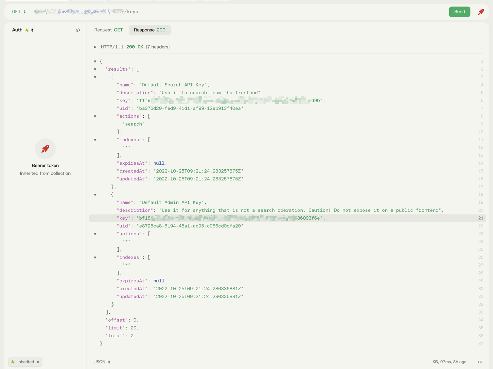

# hexo-meilisearch [![Build Status][]][pkg-build] ![][pkg-downloads] ![][pkg-version]

> Index content of your [hexo][] website in [Meilisearch][] and add search within minutes.
> This package inspiring from [hexo-algolia](https://www.npmjs.com/package/hexo-algolia)

`hexo-meilisearch` is an [hexo][] plugin provided by the community.
This is what you get when you install it:

1. a **new command**, `hexo meilisearch`, to index the content of your website
2. a **theme helper** to include Meilisearch search client
3. another **theme helper** to configure the Meilisearch search client

👌 The `hexo meilisearch` command can be run manually on your computer
and on a continuous integration system like [Travis CI][-ci-node].

📜 Browse the [CHANGELOG][] to learn what has changed between versions.
⬢ Compatible with `node>=16.0.0`.

[hexo theme][]

## Install

```bash
$ npm install --save hexo-meilisearch
```

## Public Facing Search Options

You can configure Meilisearch integration to your hexo website with the `_config.yml` file:

``` yaml
meilisearch:
  host: 'hostUrl'
  searchKey: 'YourSearchKey'
  indexName: '...'
```

| Config Key  |                                          |
|-------------|------------------------------------------|
| `host`      | Your Meilisearch Search Url              |
| `searchKey` | A **Search-Only** Key                    |
| `indexName` | The name of the Meilisearch index to use |

These configuration values are **accessible from your hexo theme**, to be used
with [Algolia JavaScript client](https://www.algolia.com/doc/guides/search/auto-complete/#user-interface).

## Hexo Theme Setup

Helpers are provided to make your life easier.

### Include Algolia JavaScript Client

The `meilisearch` theme helper adds the
[Meilisearch client][js-client] to your pages.

```html
<%- meilisearch() %>
```

Renders as:

```html

<script src="/assets/meilisearch/milisearch.umd.js" async></script>
```

### Configure Meilisearch JavaScript Client

You can make your index configuration available to your page and client-side scripts by adding the `meilisearch_config()` hexo helper in the `<head>` of your
document.

```html
<%- meilisearch_config() %>
```

Once done, you can retrieve Algolia configuration by querying the
[`data attribute`](dataset) of the `meilisearch` meta tag.

```js
const meilisearchConfig = document.querySelector('meta[property="meilisearch"]').dataset;

const client = new MeiliSearch({
    host : meilisearchConfig.host, 
    apiKey: meilisearchConfig.searchKey
});
const index  = client.index(meilisearchConfig.indexName);
```

### Display Search Results

It is now up to you to use the aforementioned example to trigger a search
and display the results in your page.

If you need some help, have a look at the [search client doc][js-client]
and [the tutorials][Meilisearch tutorials].

## Indexing Content

Content is indexed with the help of the `hexo meilisearch` command.

```bash
$ ./node_modules/.bin/hexo meilisearch
```

### API Key

A separate _API Key_ must be provided as an **environment variable** named `HEXO_MEILISEARCH_API_KEY`. Create it with **these limited write access**
permissions: `Add records`, `Delete records`, `List indices`, `Delete index`.

```bash
$ export HEXO_MEILISEARCH_API_KEY=…
$ ./node_modules/.bin/hexo meilisearch
```



### Usage

```
$ ./node_modules/.bin/hexo help meilisearch
Usage: ./node_modules/.bin/hexo meilisearch

Description:
Index your content in Meilisearch Search API

Options:
  --dry-run       Does not push content to Algolia (default: false).
  --flush         Resets the Algolia index before starting the indexation (default: false).
  --api-key       An meilisearch API key with add/delete records permissions.
		          It should be different than the search-only API key configured in _config.yml.
  --layouts       A comma-separated list of page layouts to index (default: "page").
```

### Security Concerns

**Never store your _API Key_** as `apiKey` in the `_config.yml` file: **it would give full control of your meilisearch index to others**
and [you don't want to face the consequences][daily-mirror-bonanza].

[Please read Meilisearch Security guide thoroughly][security] if you need some more informations about this.

# License

[MIT](LICENSE)

[Build Status]: https://travis-ci.org/imvkmark/hexo-algolia.svg?branch=master

[pkg-build]: https://travis-ci.org/imvkmark/hexo-meilisearch

[pkg-downloads]: https://img.shields.io/npm/dm/hexo-meilisearch.svg

[pkg-version]: https://img.shields.io/npm/v/hexo-meilisearch.svg

[hexo]: https://hexo.io/

[Meilisearch]: https://www.meilisearch.com/

[hexo theme]: https://hexo.io/docs/themes.html

[travis-ci-node]: https://docs.travis-ci.com/user/languages/javascript-with-nodejs/

[Meilisearch Tutorials]: https://docs.meilisearch.com/learn/getting_started/quick_start.html

[CHANGELOG]: https://github.com/imvkmark/hexo-meilisearch/blob/master/CHANGELOG.md

[js-client]: https://github.com/meilisearch/meilisearch-js

[batching]: https://docs.meilisearch.com/reference/api/documents.html#add-or-replace-documents

[security]: https://docs.meilisearch.com/reference/api/keys.html#key-object

[dataset]: https://developer.mozilla.org/en-US/docs/Learn/HTML/Howto/Use_data_attributes

